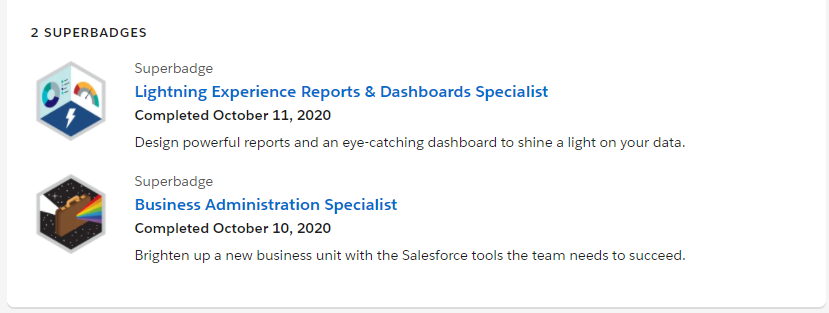
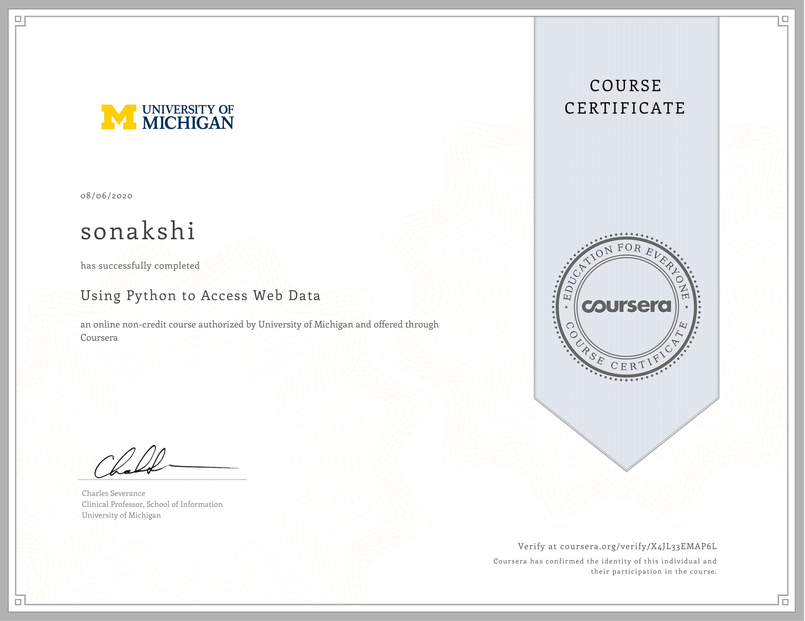
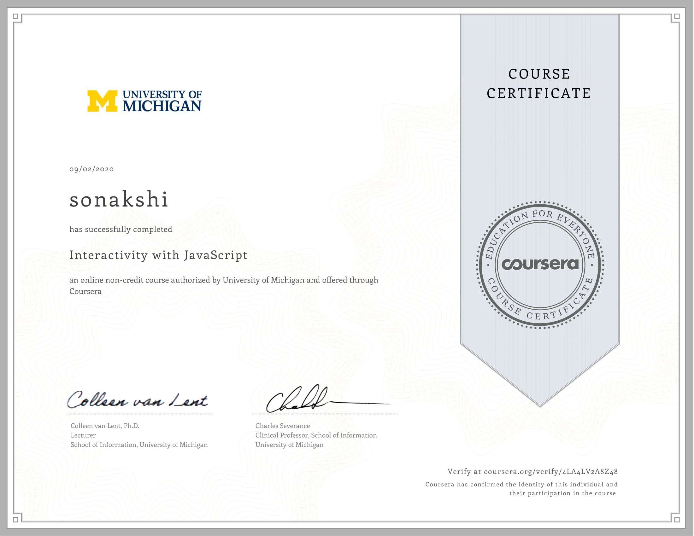
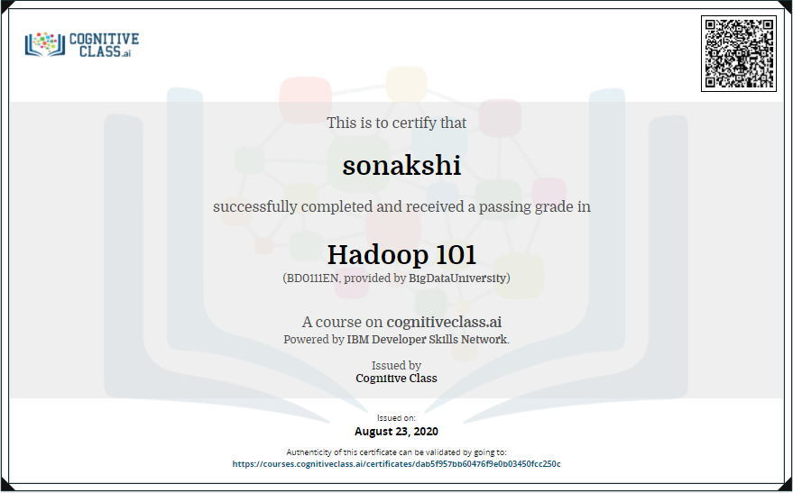
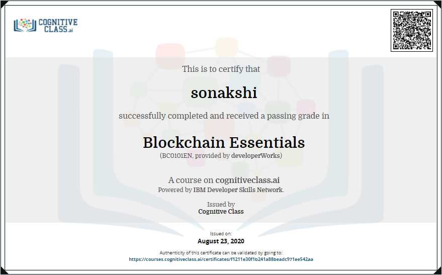

<html>
    <head>
        <title>
            Portfolio | Sonakshi
        </title>
        <link rel="stylesheet" href="index.css">
        
        <meta name ="viewport" content="width=device-width, initial-scale=1">
        <link rel="stylesheet" href="https://maxcdn.bootstrapcdn.com/bootstrap/3.3.7/css/bootstrap.min.css" integrity="sha384-BVYiiSIFeK1dGmJRAkycuHAHRg32OmUcww7on3RYdg4Va+PmSTsz/K68vbdEjh4u" crossorigin="anonymous">
    </head>
    <body>
            

                <header class="col-md-12">
                    <a href="#heading1" id="qua" class="col-md-4">|My qualifications|</a> 
                    <a href="#heading2" id="achi" class="col-md-4">|My Achievements|</a>
                    <a href="#heading3" id="work" class="col-md-4">|Work Experience|</a> 
                </header>
            
                

                    

                        
                    

                    

                        
Hey! I am Sonakshi <i class="fas fa-smile-wink"></i> 
                        <ul>
                        <li>A Web Designer  <i class="fas fa-laptop-code" ></i></li>
                        <li>A Database Manager  <i class="fas fa-database" ></i></li>
                        <li>A Python coder  <i class="fab fa-python" ></i></li>
                        <li>An Engineering Student  <i class="fas fa-graduation-cap" ></i></li>
                        <li>And.. Whatever you want me to be  <i class="fas fa-infinity" ></i></li>
                        </ul>    
                        

                    

                

                    

                        
My Qualifications

                        

                              <i class="fas fa-star"></i>  Academic Qualifications
                            

                            <ul class="supersubpoint1">
                                <li>High School from Rich Harvest Public School, Delhi, with 8.6 CGPA (All Subjects) in year 2017</li>

                                <li>Senior Secondary from Rich Harvest Public School, Delhi, with 90.4% (PCM & C++) in year 2019</li>

                                <li>Currently pursuing Bachelors of Technology (BTech) in Computer Science with IBM specialization in "Cyber Security and Forensics", with 9.28 CGPA (upto current semester) from Manav Rachna International Institute of Research and Studies, Faridabad</li>
                            </ul>
                        

                        

                             <i class="fas fa-star"></i>Programming proficiency
                            

                            <ul class="supersubpoint1">
                                <li>C & C++ Programming</li>
                                <li>Python Programming</li>
                                <li>HTML5</li>
                                <li>CSS3</li>
                                <li>PHP</li>
                                <li>JavaScript</li>
                                <li>SQL</li>
                            </ul>
                        

                        

                             <i class="fas fa-star"></i>Technical Expertise
                            

                            <ul class="supersubpoint1">
                                <li>Microsoft Office (MS PowerPoint, Excel, Word)</li>
                                <li>Ispring Suite</li>
                                <li>Database:  Sqlite Browser, Microsoft SQL Server, PHPMyAdmin</li>
                                <li>Operating System: Windows XP, 7, 10</li>
                                <li>Ranger Rank on Salesforce</li>
                            </ul>
                        

                    

                    

                        

                            Achievements and Certification
                        

                        

                            
Salesforce Superbadges &nbsp;<i class="fab fa-salesforce fa-lg" ></i> 
                                Click on the image below to know more &nbsp;<i class="fas fa-hand-point-down"></i>
                            

                                
                        

                        

                            
                            Python Specialization from University of Michigan
                        

                        

                            
                            "Python Data Structures" from University of Michigan
                        

                        

                            
                            "Database Management with python" from University of Michigan
                        

                        

                            
                            "Accessing Web Data using python" from University of Michigan
                        

                        

                            
                            "Getting started with python" from University of Michigan
                        

                        

                            
                            "Python Fundamentals" from University of Toronto
                        

                        

                            
                            "Python Capstone" from University of Michigan
                        

                        

                            
                            "Introduction to HTML5" from University of Michigan
                        

                        

                            
                            "Introduction to CSS3" from University of Michigan
                        

                        

                            
                            "Interactivity with JavaScript" from University of Michigan
                        

                        

                            
                            "Advanced Styling with Responsive Design" from University of Michigan
                        

                        

                            
                            One Month JavaScript program by LetsUpgrade
                        

                        

                            
                            8 sessions of Python program by LetsUpgrade
                        

                        

                            
                            A Complete Web Development course(Backend) from Udemy
                        

                        

                            
                            "Hadoop Fundamentals Certified" by IBM
                        

                        

                            
                            "Blockchain Fundamentals Certified" by IBM
                        

                    

                    

                        
My work Experience

                        <ul class="content6"class="col-md-12">
                            Professional Work Experience
                            <li>Working as Operations analyst intern at <b>HTC Global Services,Chennai, India</b> since june 2020</li>
                            <li>Working as an Ambassador at <b>Circolo</b></li>
                            <li>Also working for improvement of Circolo's Website</li>
                            <li>Worked as web developer intern at <b>The Sparks Foundation</b> from december 2020 to january 2021 </li>
                            <li>Worked as web developer intern at <b>Aprobacian(OPC) pvt. ltd.</b> from november 2020 to december 2021 </li>
                            <li>I am also working as a Content Creator intern at <b>Creatorshala</b> since august 2020</li>
                        </ul>
                        <ul class="content6" class="col-md-12">
                            Ongoing Research work
                            <li><b>Analysis on Apache Hadoop and Apache Spark</b>: In this, I had provided a comparative study between the two major big data technologies, which can be used by many other developers handling the big data.</li>
                            <li><b>Database encryption decryption in C++</b>: In this project me and my team mates are developing a system that securely enters user's crucial data in encrypted form in the database and is decrypted whenever needed.</li>
                            <li><b>Interactive Calender in C</b>: We are creating an interactive calender in C which will be very easy and comfortable for user to access and search through.</li>
                        </ul>
                        <ul class="content6" class="col-md-12">
                            Completed Projects
                            <li><b>Car hiring system using blockchain Technology in Python</b>: 
                            The main objective of this project is to remove organizational role from car hiring systems like Yulu cycles and Zoom cars with the help of blockchain technology.</li>
                        </ul>
                    

        

        
    </body>
</html>
